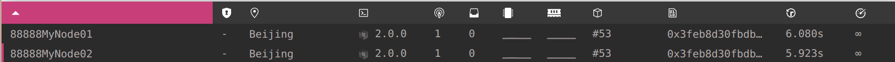
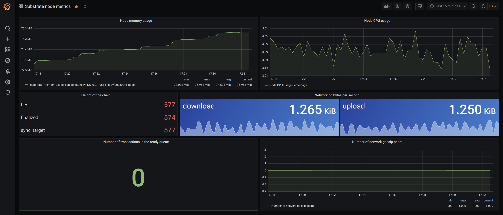

# Homework for lesson 12

答案放在README文件里即可。

## 1. 为 template 模块的 do_something 添加 benchmark 用例（也可以是其它自选模块的可调用函数），并且将 benchmark 运行的结果转换为对应的权重定义；

Note: 上传benchmark运行结果的命令行截图和最终的可调用函数代码片段（包含权重设置）。

```
➜  lesson12 git:(lesson12) make benchmarks 
cd node;cargo build --release --features runtime-benchmarks
   Compiling node-template-runtime v2.0.0-rc2 (/data/test/team4/lesson12/runtime)
   Compiling pallet-template v2.0.0-rc2 (/data/test/team4/lesson12/pallets/template)
   Compiling node-template v2.0.0-rc2 (/data/test/team4/lesson12/node)
    Finished release [optimized] target(s) in 1m 47s
target/release/node-template benchmark \
        --chain=dev \
        --execution=wasm \
        --wasm-execution=compiled \
        --pallet=pallet-template \
        --extrinsic=do_something \
        --steps=20 \
        --repeat=51
Pallet: "pallet-template", Extrinsic: "do_something", Lowest values: [], Highest values: [], Steps: [20], Repeat: 51
Median Slopes Analysis
========

Model:
Time ~=    14.81
    + b        0
              µs

Min Squares Analysis
========

Data points distribution:
    b   mean µs  sigma µs       %
    1     14.96     0.128    0.8%
   50      14.8     0.052    0.3%
   99     14.77     0.055    0.3%
  148     14.73     0.039    0.2%
  197     14.87     0.146    0.9%
  246     14.75     0.042    0.2%
  295     14.76     0.032    0.2%
  344      14.8     0.067    0.4%
  393     14.75     0.047    0.3%
  442     14.72     0.058    0.3%
  491     14.69     0.052    0.3%
  540     14.74      0.05    0.3%
  589     14.67     0.053    0.3%
  638     14.69     0.064    0.4%
  687     14.71     0.044    0.2%
  736      14.7     0.071    0.4%
  785     14.73      0.06    0.4%
  834     14.67     0.069    0.4%
  883      14.7     0.058    0.3%
  932     14.68     0.053    0.3%
  981     14.71     0.044    0.2%

Quality and confidence:
param     error
b             0

Model:
Time ~=    14.83
    + b        0
              µs

```

```
/// # <weight>
/// - Base Weight: 14.83 µs
/// - DB Weight: 1 Write
/// # </weight>
#[weight = T::DbWeight::get().writes(1) + 15*1_000_000]
pub fn do_something(origin, something: u32) -> dispatch::DispatchResult {
```


## 2. 选择 node-template 或者其它节点程序，生成 Chain Spec 文件（两种格式都需要）；

Note: 上传 Chain Spec 文件即可

```
➜  lesson12 git:(lesson12) subkey --sr25519 generate
Secret phrase `slogan soon trick february forum wet size lawn quality profit curve drop` is account:
  Public key (hex):   0x86faf39938a111ea0c9bbc7680178087eda6c7306b24c6d8d7e832fe7f94c62f
  SS58 Address:       5F7gpd79yteeTP4XEBi7TgkZbPMvYZDPq1i6CzKq9HQ15K2z

➜  lesson12 git:(lesson12) ✗ subkey --ed25519 inspect "slogan soon trick february forum wet size lawn quality profit curve drop"
  Public key (hex):   0x71e5bfe8069bcd612149270425866c99c48fbe9f001a15e66e3b5a88674339c8
  SS58 Address:       5Ee3WzuNqVa4o3jbkQdH969aLU5sVMJ4BVxRVPEzK8wisumG

➜  lesson12 git:(lesson12) ✗ subkey --sr25519 generate
Secret phrase `tribe empty shaft impact record dream knife cluster reflect universe tomato evil` is account:
  Public key (hex):   0x90590abd3bafb44207f471846261f2699ffe6f5fa033bf685209316915a44d48
  SS58 Address:       5FKyCky9NQB2KGv97WerhKBBfrP18du2vKwfSnQqnmfePXVt

➜  lesson12 git:(lesson12) ✗ subkey --ed25519 inspect "tribe empty shaft impact record dream knife cluster reflect universe tomato evil"
  Public key (hex):   0xe9b8fd842a5edee7d14dd730b150d5094fe085a0e20fbe3d1282b1ed536b467b
  SS58 Address:       5HM9y6FKM5zQz3YwMwaeQRbDu284j4sDv6wBVV7jLnrRXhDw

target/release/node-template build-spec --disable-default-bootnode --chain local > customSpec.json

      "aura": {
        "authorities": [ "5F7gpd79yteeTP4XEBi7TgkZbPMvYZDPq1i6CzKq9HQ15K2z",
          "5FKyCky9NQB2KGv97WerhKBBfrP18du2vKwfSnQqnmfePXVt" ] },
      "grandpa": {
        "authorities": [ [ "5Ee3WzuNqVa4o3jbkQdH969aLU5sVMJ4BVxRVPEzK8wisumG", 1 ],
          [ "5HM9y6FKM5zQz3YwMwaeQRbDu284j4sDv6wBVV7jLnrRXhDw", 1 ] ] },

target/release/node-template build-spec --chain=customSpec.json --raw --disable-default-bootnode > customSpecRaw.json
```

## 3.（附加题）根据 Chain Spec，部署公开测试网络。

Note: 上传 telemetry.polkadot.io 上你的网络节点的截图，或者apps上staking页面截图。

```
target/release/node-template purge-chain --chain customSpecRaw.json -y -d target/node01
target/release/node-template purge-chain --chain customSpecRaw.json -y -d target/node02


➜  lesson12 git:(lesson12) ✗ subkey --ed25519 inspect "tribe empty shaft impact record dream knife cluster reflect universe tomato evil//1"   
Secret Key URI `tribe empty shaft impact record dream knife cluster reflect universe tomato evil//1` is account:
  Secret seed:        0xf0dd31f81858a9a391b0a1b33b3e838b116b4c7dd8367da1b8bea7b78d12d3c8
  Account ID:         0xbe7df854c9b3b41a078e91cfbd1e7a4b3228a8e4067783ae00494d5cda5a9f9d
  SS58 Address:       5GNUNmheek8SJyn4Mmygup9ugoZwZxWwv1ZJHfvBQKNWNP46

Secret Seed (aka "Private Key" or "Raw Seed") - The minimum necessary information to restore the key pair.

target/release/node-template \
  --node-key-type Ed25519 \
  --node-key f0dd31f81858a9a391b0a1b33b3e838b116b4c7dd8367da1b8bea7b78d12d3c8 \
  --base-path target/node01 \
  --chain=customSpecRaw.json \
  --port 30333 \
  --ws-port 9944 \
  --rpc-port 9933 \
  --telemetry-url 'ws://telemetry.polkadot.io:1024 0' \
  --validator \
  --rpc-methods=Unsafe \
  --name 88888MyNode01

curl http://localhost:9933 -H "Content-Type:application/json;charset=utf-8" -d "@/data/test/team4/lesson12/node01-aura.json"
curl http://localhost:9933 -H "Content-Type:application/json;charset=utf-8" -d "@/data/test/team4/lesson12/node01-gran.json"

查询 peerId
curl -H "Content-Type: application/json" -d '{"id":1, "jsonrpc":"2.0", "method": "system_localPeerId", "params":[]}' http://localhost:9933


target/release/node-template \
  --base-path target/node02 \
  --chain=customSpecRaw.json \
  --port 30334 \
  --ws-port 9945 \
  --rpc-port 9934 \
  --telemetry-url 'ws://telemetry.polkadot.io:1024 0' \
  --validator \
  --rpc-methods=Unsafe \
  --name 88888MyNode02 \
  --bootnodes /ip4/127.0.0.1/tcp/30333/p2p/12D3KooWNdy3GaXuPV7xnDLMHYucvRjpKQ2b6zoQMCdEkJkqHyjS

curl http://localhost:9934 -H "Content-Type:application/json;charset=utf-8" -d "@/data/test/team4/lesson12/node02-aura.json"
curl http://localhost:9934 -H "Content-Type:application/json;charset=utf-8" -d "@/data/test/team4/lesson12/node02-gran.json"


```



```
curl localhost:9615/metrics
sudo prometheus --config.file prometheus.yml
sudo service prometheus status
http://localhost:9090/

Ubuntu and Debian(64 Bit)SHA256: 0d55bb65cd9bcc6445555e304493240801bd8e84c54a693ae8a23f583b72018c
sudo apt-get install -y adduser libfontconfig1
wget https://dl.grafana.com/oss/release/grafana_7.1.0_amd64.deb
sudo dpkg -i grafana_7.1.0_amd64.deb
sudo systemctl daemon-reload
sudo systemctl start grafana-server
sudo systemctl status grafana-server
sudo systemctl enable grafana-server.service
http://localhost:3000/

```

