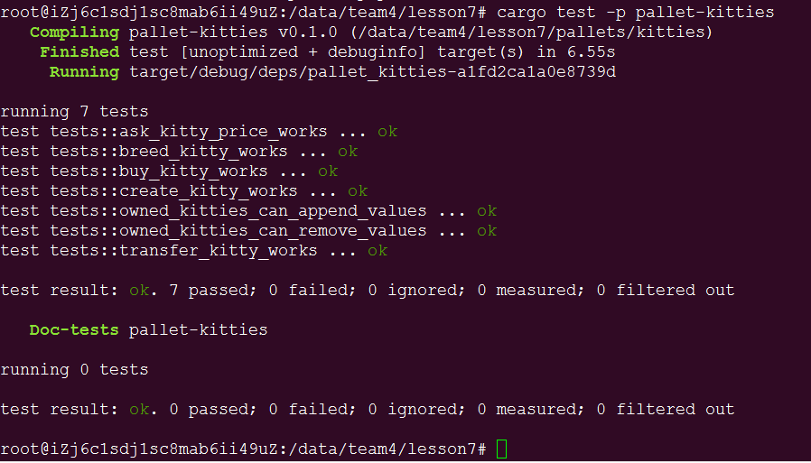

# Lesson 7 Homework

## 第一题

补完剩下的代码:  

https://github.com/SubstrateCourse/substrate-kitties/blob/lesson7/pallets/kitties/src/linked_item.rs  

作业部份已补充完整。

## 修复单元测试

代码已补充。另外增加 create、breed、transfer、ask、buy等功能测试，测试完成截图如下：  

## 阅读pallet-membership源码

### A-分析 add_member的计算复杂度  

1、binary_search操作，复杂度: O(LogN);   
2、change_members_sorted操作，复杂度: N;  

总计算复杂度为 O(LogN) + N

### B-分析 pallet-membership是否符合以下场景使用，提供原因：

* 储存预言机提供者  
    pallet-membership符合此场景，因为预言机提供者在一段时间内会相对稳定。
* 储存游戏链中每个工会的成员  
    pallet-membership符合此场景，因为预言机提供者在一段时间内会相对稳定。可以使用Prime设置主席身份，拥有较大的权重。
* 储存POA网络验证  
    pallet-membership不符合此场景，因为POA网络验证是随机产生的，没有规律。

