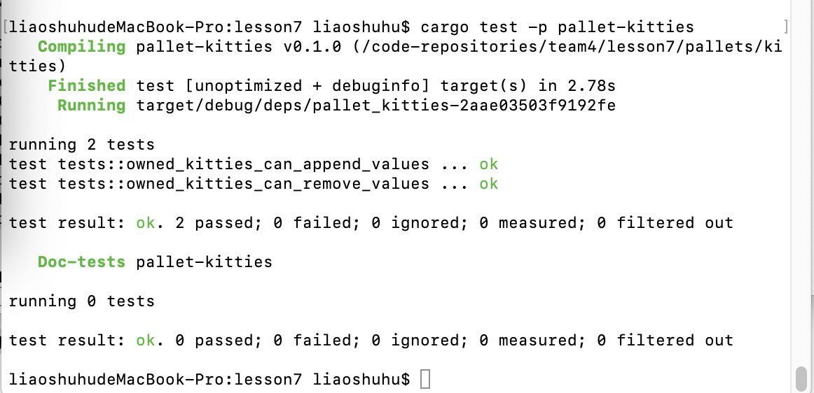

# Lesson 7 Homework

## 第一题

补充完整的代码链接:  

https://github.com/lshoo/team4/tree/lesson-7/lesson7/pallets/kitties/src/linked_item.rs  

## 修复单元测试

测试完成截图如下：  

## 阅读pallet-membership源码

### A-分析 add_member的计算复杂度  
  >函数的计算复杂度部门是搜索插入的binary_search/insert,以及排序的change_members_sorted:
  >binary_search复杂度为O(logN),change_members_sorted复杂度为O(N)
 

### B-分析 pallet-membership是否符合以下场景使用，提供原因：

* 储存预言机提供者  
  >预言机一般数量不多,适合.  
* 储存游戏链中每个工会的成员  
  >游戏中的所有成员数量巨大,不适合.  
* 储存POA网络验证  
  >POA验证节点数量也较少,适合
  
